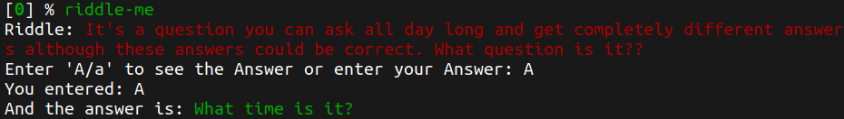

# zsh-riddle-me

Custom [zsh](https://www.zsh.org/) plugin to generate random Riddles.

## How to use?

It's super easy to use. Just type `riddle-me` in your terminal and enjoy the riddles.

## How to Install?

Depending on the plugin manager you use, add following to your `.zshrc` file and source it.

### [oh-my-zsh](https://github.com/ohmyzsh/ohmyzsh)

1. Clone the repo into your custom plugins folder, usually at ($HOME/.oh-my-zsh/custom/plugins/)

   ```shell
   git clone https://gitlab.com/vkolagotla/zsh-riddle-me.git ~/.oh-my-zsh/custom/plugins/zsh-riddle-me
   ```

2. Add `zsh-riddle-me` to .zshrc plugin list, usually at (~/.zshrc)

   ```shell
   plugins=(... zsh-riddle-me)
   ```

### [Zplug](https://github.com/zplug/zplug)

```shell
zplug "vkolagotla/zsh-riddle-me"
```

### [Antigen](https://github.com/zsh-users/antigen)

```shell
antigen bundle "vkolagotla/zsh-riddle-me"
```

### [Zgen](https://github.com/tarjoilija/zgen)

```shell
zgen load "vkolagotla/zsh-riddle-me"
```

Source .zshrc file

```shell
source ~/.zshrc
```

**Sample output**



## TODO

- [ ] Fix random HTML elements occurrence in text.
- [ ] Cleaver use of `sed` to filter the riddle text.
- [ ] Update hints.

## Source of riddles

* https://goodriddlesnow.com/riddles/random

## About LICENSE

I created this plugin for personal use. The plugin [LICENSE](LICENSE) is only valid for the code. Since the riddles are fetched from an external source(online), i do not own that data. I would suggest you to not use the plugin for any commercial purpose, unless you have the permission to do so from those respective data sources.

[Go UP⬆️](#zsh-riddle-me)